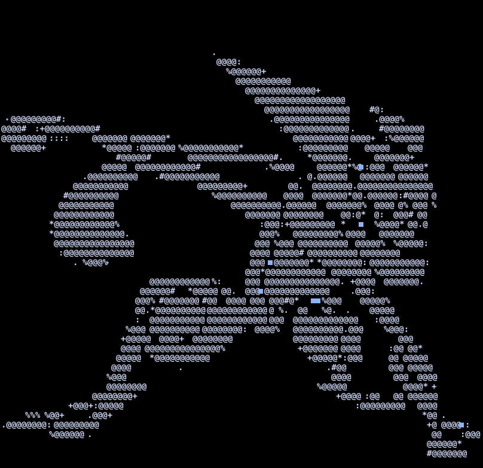

<div>

### `irtaza@github:~$ help`

<pre>
Available commands

<a href="#whoami">whoami</a>             About me
<a href="#neofetch">neofetch</a>           System information
<a href="#tree">tree</a>               Featured Projects
<a href="#contact">curl irtaza.xyz</a>    Contact
<a href="#git-shortlog">git shortlog</a>       GitHub stats
<a href="#quests">cat goals.md</a>       Current goals
<a href="#pokedex">pokedex</a>            Favourite Pokemon
<a href="#bookshelf">bookshelf</a>          Reading list
</pre>

</div>

---

<a id="whoami"></a>

### `irtaza@github:~$ whoami`

<pre>
<b>Syed Muhammad Irtaza</b>
Dev. Maker. Game Developer.
<b><i>I try to build cool stuff!</i></b>
</pre>

---

<a id="neofetch"></a>

### `irtaza@github:~$ neofetch`

<table>
<tr>
<td width="170">


</td>
<td>

```
Irtaza@github
--------------------------
OS:       IrtOS 17.0
Host:     Pakistan
Kernel:   Curiosity
Shell:    bash
Terminal: GitHub
Uptime:   17 years
Editor:   VS Code

Languages:
██████████ C#
█████████░ JavaScript
████████░░ HTML/CSS
███████░░░ TypeScript
██████░░░░ React
█████░░░░░ Python

Stack: Unity · RP2040 · KiCad · Premiere Pro · Figma
```

</td>
</tr>
</table>

---

<a id="tree"></a>

### `irtaza@github:~$ tree projects/`

<pre>
projects
│
├── games
│   ├── <a href="https://irtaza.itch.io/cozy-farm">Cozy Farm</a>
│   └── <a href="https://irtaza.itch.io/dicefront">Dicefront</a>
│
├── hardware
│   ├── <a href="https://github.com/Irtaza2009/PiShot">PiShot</a>
│   └── <a href="https://github.com/Irtaza2009/Hackamon">Hackamon</a>
│
└── tools
    ├── <a href="https://github.com/Irtaza2009/Arena">Arena</a>
    └── <a href="https://github.com/Irtaza2009/HC-Stickers-Manager">Sticker Manager</a>

3 directories, 6 favourite projects
</pre>

---

<a id="git-shortlog"></a>

### `irtaza@github:~$ git shortlog`


---

<a id="contact"></a>

### `irtaza@github:~$ curl irtaza.xyz`

<pre>
HTTP/2 200 OK

{
    "<a href="https://irtaza.xyz">portfolio</a>": "online",
    "<a href="https://github.com/Irtaza2009">github</a>": "connected",
    "<a href="https://www.youtube.com/@DevStuff5">youtube</a>": "creating",
    "<a href="https://www.instagram.com/irtaza.dev.stuff">instagram</a>": "active",
    "<a href="mailto:irtazanaqvi05@gmail.com">email</a>": "available"
}
</pre>

---

<a id="quests"></a>

### `irtaza@github:~$ cat goals.md`

```
███████░░░ First released mobile game
████████░░ YouTube devlogs
██████░░░░ Useful Open-source software
█████░░░░░ Win more hackathons
```

---

<a id="pokedex"></a>

### `irtaza@github:~$ pokedex --favorite`

<pre>
<b>Pokemon:</b>          Greninja
<b>Region:</b>           Kalos
<b>Starter:</b>          Froakie
<b>Legendary pick:</b>   Hoopa
<b>Favorite game:</b>    Pokopia
</pre>

---

<a id="bookshelf"></a>

### `~/home/irtaza $ cat bookshelf.md`

```
Currently reading:
  And Then There Were None

Favorites (lots, but top 2):
  Percy Jackson
  Chronicles of Narnia
```

---

<details>
<summary><code>~/home/irtaza $ sl</code></summary>

```
     ====        ________                ___________
  _D _|  |_______/        \__I_I_____===__|_________|
   |(_)---  |   H\________/ |   |        =|___ ___|
   /     |  |   H  |  |     |   |         ||_| |_||
  |      |  |   H  |__--------------------| [___] |
  | ________|___H__/__|_____/[][]~\_______|       |
  |/ |   |-----------I_____I [][] []  D   |=======|
__/ =| o |=-~~\  /~~\  /~~\  /~~\ ____Pl__|_____.-'
 |/-=|___|=    ||    ||    ||    |_____________|
  \_/      \O=====O=====O=====O_/
```

Typed `sl` instead of `ls` again. Classic.

(also this ^ is a train!!)

</details>

<details>
<summary><code>~/home/irtaza $ sudo make cool-stuff</code></summary>

```
[sudo] password for irtaza: ********
Compiling...
Done.
```

</details>

<details>
<summary>Konami code</summary>

```
↑ ↑ ↓ ↓ ← → ← → B A — try it on the live site. Here it just unlocks this sentence. On the site, it does nothing!
```

</details>

---

<div align="center">


<br>

<code>~/home/irtaza $</code> 

</div>
